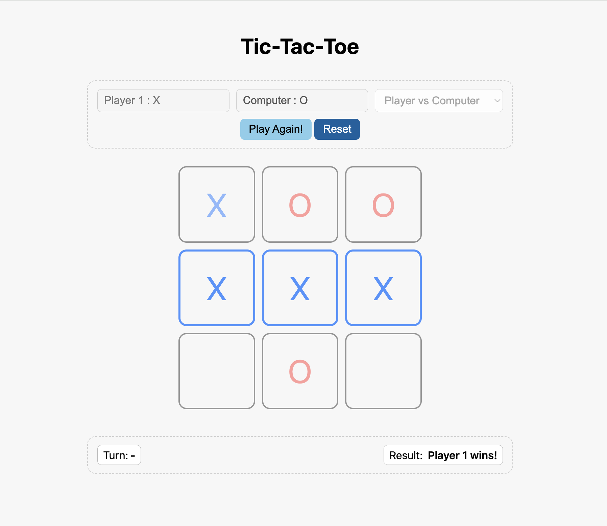

# Tic-Tac-Toe Game (Player vs Player / Player vs Computer)

A simple **Tic-Tac-Toe** game built with **HTML, CSS, and JavaScript**.  
This project was made to practice **modular JavaScript** and **DOM manipulation**

## Screenshot

## Features
- Play in two modes:
  - Player vs Player
  - Player vs Computer (random moves on empty cells for now)
- Live status display:
  - Whose turn it is
  - Win or Tie result
- Buttons:
  - Start/Play Again 
  - Reset (to change names and mode)

## How To Play
- Enter player names (or select Player vs Computer mode)
- Hit **Start** Button to play!
- Hit **Play Again!** to play with same settings (mode and player(s) name).

## What I Practiced / Learned
- **Modular JavaScript** using IIFEs (`Gameboard`, `Player`, `GameController`, `DisplayController`, `gameStateControl`)
- **DOM manipulation** (updating board, highlighting winners, showing results)
- **Game logic** (checking win conditions, switching turns, detecting ties)
- **Responsive CSS** with:
  - `clamp()`, `minmax()`, and `aspect-ratio`
  - Mobile-first adjustments with media queries
- Handling **Player vs Computer** logic (basic random moves)

## Future Improvements
- Make the computer choice smarter:
  - Block th elayer from winning
  - Pick winning moves if available
- Add a scoreboard to track win/loses
- Better UX/UI

  ## Live Demo
Check out the live version of the game here: [Play Tic-Tac-Toe](https://ni-ki-web.github.io/tic-tac-toe/)
